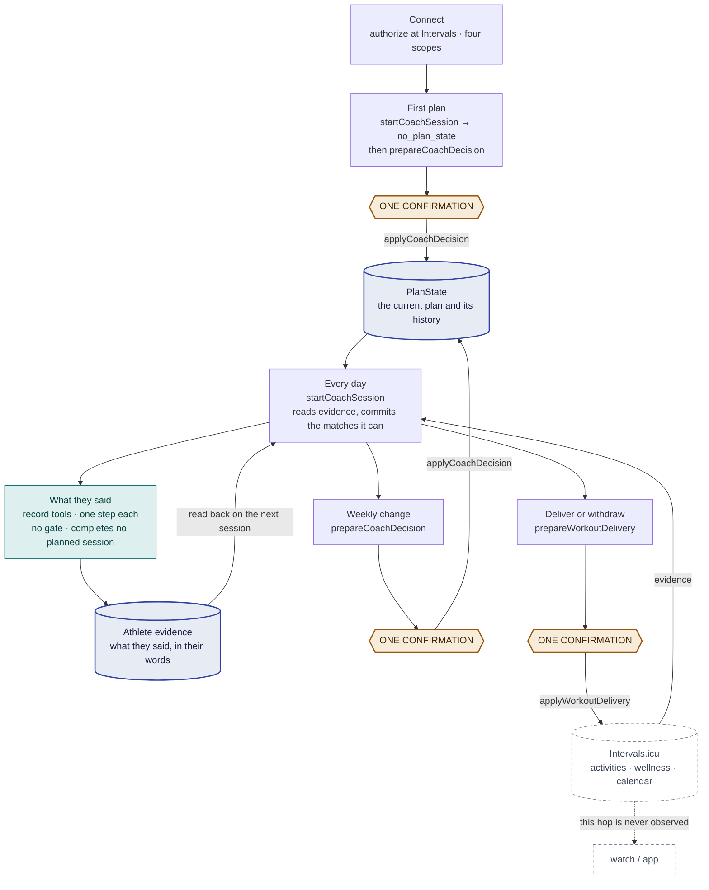
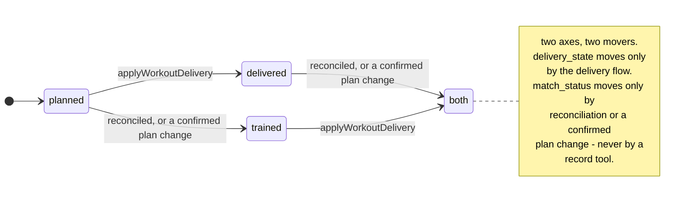

# User flows — what an athlete does, and what it calls

[docs/user-story.md](user-story.md) says what the product is for.
[`garmin_coach_loop/orchestration.md`](../garmin_coach_loop/orchestration.md) is the
served, canonical contract: which call answers which question, and what each one may and
may not carry. It is written for a model — imperative, ordered by call — and a person
reading it cannot assemble the shape of a session from it.

This page is that shape, and only that shape. **It is deliberately not a second copy of
the tool contract:** per-tool rules, field lists and error semantics stay in
`orchestration.md` and in the schemas in
[`garmin_coach_loop/mcp_transport.py`](../garmin_coach_loop/mcp_transport.py), because a
second specification drifts and the served one is the one clients obey. Where this page
would have to restate one, it links instead.

It is a service blueprint: what the athlete says and sees, kept separate from what the
coach calls on their behalf, and both from what lives outside this product. The product
has no screens, so the entire middle layer is invisible. They see a conversation.

## Every operation is one of three shapes

Learn these and the twenty-two tools stop needing to be memorised.

**Read** — four tools. Change nothing, ask nobody. `getCoachState` is the genuinely
read-only one. `startCoachSession` is the exception that proves the rule: it reads, but
reconciliation is made of store commits, so a plan can come back at a higher version than
it went in at.

**Record** — eleven tools. Store what the athlete said, in their words, one step, echoed
straight back. None of them touches PlanState, none writes to Intervals, and **none
completes a planned session.** How a restatement composes with what is already stored
differs by tool — most replace, some compose, an upload merges against what is already
held — and `orchestration.md` is where each one says which.

**Gate** — seven tools. Build a preview that writes nothing, show all of it, take one
confirmation, then apply with the returned proposal unchanged. Plan changes, calendar
delivery, withdrawal, and account deletion are the same five steps in the same order.

## The blueprint

All of it is invisible to the athlete. They say "what should I do today", and one
`startCoachSession` behind that sentence reads the evidence, commits the matches it can
make, and answers.

The two stores are separate on purpose. **PlanState holds the current plan and its
history; athlete evidence holds what the athlete said.** Neither is reconstructed from a
conversation — a plan rebuilt from what an earlier chat said is a *second* plan — and one
athlete has one current writer over both.

The hexagons are where a write waits for a person. Withdrawal is a fourth such place, on
the same gate as delivery, and `clearDeliveryAttempt` takes the athlete's confirmation
too; the figure marks the three the ordinary journey passes through.

The dashed edge at the bottom is the one hop this product cannot see. Intervals accepting
an event is the furthest thing any state may claim.

## First contact

Authorizing at Intervals.icu is what creates the account. There is no sign-up and no
password — the athlete you authorize as *is* the account, keyed on the athlete id rather
than on the token, so a second client or a later reconnect resolves to the same plan
mid-cycle. Nothing about the athlete is required to create it.

A profile is asked for later and separately: the first 28 days are laid out on dates, and
which dates those are depends on which day it is where the athlete lives, so the first plan
names an unstated timezone among its unknowns and asks. It is not a gate — an athlete who
does not want to say still gets their plan, and can see what it was built on.

Before any of that, the client registers. One class of client is refused there rather than
at sign-in: a client hosted elsewhere that takes its OAuth callback on its own domain, until
that origin is added to the deployment's trusted set. A client on the athlete's own machine,
whose callback lands on loopback, connects as is. The refusal is about where the callback
lands, not about what the client can do.

The four consent boxes are independent, and a missing one fails only the capability that
needed it: `ACTIVITY:READ` and `WELLNESS:READ` for evidence, `CALENDAR:WRITE` for delivery
and its read-back, `SETTINGS:WRITE` for the narrow threshold correction a paced workout
sometimes needs.

The first coaching question is a coaching question, not a questionnaire.
`startCoachSession` answers `no_plan_state` and carries the months Intervals has been
holding all along. What is left to ask is what no record holds and what changes the plan —
the goal, the days, a baseline no device measures. Asking for the rest collects a worse
answer than the record already has, and spends the one turn where the athlete is deciding
whether this is worth using.

The first plan is one `prepareCoachDecision` covering all four weeks: this week precise
and deliverable, weeks two to four an outline that does not pretend to know detail it
cannot have yet. Nothing is stored until the confirmation.

## A normal day

Daily use is pull-based. Normal days follow the stored plan; a conversation happens when
the athlete asks what to do, reports something the plan should know, or a review condition
arrives.

`startCoachSession` opens every one of those. Besides reading fresh evidence it commits
the planned-to-actual matches it can make deterministically — identity-backed and complete
only. Ambiguous or partial matches stay visible and are never guessed.

Weeks are Monday to Sunday, not a rolling seven days. Finishing the sessions is not by
itself evidence that fitness improved: without the cycle's own measurement protocol having
run, progress is unproven and no wearable number stands in for it.

## What the answer turns on

Which call happens is above. What the answer *turns on* is a separate question with its own
owner: [docs/decision-evidence.md](decision-evidence.md) records, per coaching layer, the
evidence a decision cannot be reached without — and, more useful in practice, the evidence
that must not participate in it at all.

Five layers, and each may change only what it is for:

| the question being answered | may change |
| --- | --- |
| **First plan** — what are we doing, starting from no PlanState | everything: goal, cycle, week and outlook at once. The only layer that may |
| **Revisit today** — what do I do today, given what changed today | today |
| **Weekly change** — what does the coming week look like | this week, and the outlook the roll leaves behind |
| **Weekly review** — did last week do what it was for, and did the athlete absorb it | this week; reaching the cycle takes its own decision |
| **Cycle review** — did the 28 days achieve what they declared, and what is next | everything, including the goal |

These are a product model, not five things a receipt can be sorted by afterwards: the store
cannot distinguish a today-decision from a weekly reassessment, because both land as
`review_week`.

What each layer *refuses* is the load-bearing half.

- **Available time is not a load mandate.** Four committed cases hold this one line.
- **A recovery reading is not permission.** It lowers what an answer may claim; it does not
  grant a session.
- **Asking twice is not new evidence.**
- **A one-day constraint says nothing about the 28-day direction**, and a week may not move
  the goal or the seven cycle keys — enforced in the validator, not advised.
- **Completion is not progress.** This is the single most likely way an athlete gets told a
  cycle worked when it did not.

### The same sentence, four answers

[`evals/cases/`](../evals/cases) is where those stop being principles and start being
executable. Forty-seven cases carrying all five coaching modes, each naming the evidence
fields it reads and what the answer must state. The modes and the layers above are close
but not one-to-one — a first plan and a cycle review both write `plan_cycle` — and
`decision-evidence.md` is where each layer says which cases cover it. Four of them share one athlete sentence —
今天有空，還能再練嗎 — and differ only in what else is true:

| what else is true | the answer |
| --- | --- |
| two of this week's four sessions were missed while travelling | put the threshold session back at its prescribed shape and let the strength session go — both in one afternoon is a harder day than either was meant to be |
| tomorrow carries the week's threshold run | not tonight, and specifically not legs; the 45 minutes are real, and a walk spends them as movement rather than training |
| every session this week attached and completed | no — the stimulus is already in, so a fifth session adds cost carried into Monday rather than adaptation |
| today's easy run is done and nothing is being protected | yes, and the useful version is small: easy aerobic time under the heart-rate ceiling already on record |

Each layer carries both kinds of case on purpose. A *harmful* case pins something the coach
must not do; a *control* case pins that the same evidence must not make it refuse a
reasonable request. Only holding the first would buy safety by making the coach useless,
which is the failure AGENTS.md 5 exists to prevent.

Nothing in that table is a rule the product enforces. The cases pin the reasoning — what was
read, and what the answer may not be — and leave the coaching to the model (AGENTS.md 4).

## Where each sentence lands

Every row below is the athlete's word, never a provider actual, and none of them completes
a planned session. What each tool accepts, and what a restatement does to what is already
stored, is in
[`orchestration.md`](../garmin_coach_loop/orchestration.md#what-the-athlete-tells-you-that-no-device-records).

| The athlete says | It goes to |
| --- | --- |
| where they are, which language | `recordAthleteProfile` |
| which days they can train | `recordAthleteAvailability` |
| an aim past this cycle | `recordLongTermGoal` |
| a habit — "Friday is my quality day" | `recordTrainingPreference` |
| sets they lifted | `recordStrengthExecution` |
| a planned strength session was done | `confirmPrescribedStrength` |
| a weight or body fat reading | `recordBodyMeasurement` |
| a session no device caught | `recordActivitySummary` |
| how they feel — tired, poor sleep | `recordSubjectiveState` |
| an uploaded export | `importAthleteHistory` |
| that a stored record should not stand | `retractAthleteRecord` |
| a symptom — pain, dizziness, illness | `startCoachSession`'s `red_flags` |

The last two rows are the boundary worth knowing. "I am exhausted" stores a sentence and
fires nothing, and what a run of them means is for a person to read from the notes and
their dates. "My chest hurts" is not a record at all: it limits the day deterministically.
Keeping them apart is what stops a complaint from being quietly converted into a recovery
number nobody measured.

## A weekly change

One conversation, one change request, however many sessions it moves. It carries coaching
judgment and nothing else — what changed, why, on what evidence, and what should trigger
the next look. Ids, versions, hashes, timestamps and delivery bookkeeping belong to the
gateway.

Two shape rules outlive any single change. There is no remove: dropping a session means
replacing it with rest or recovery, so the decision stays visible in the plan's history
rather than vanishing from it. And weeks two to four roll — when a review makes the next
week precise, the new week and the shortened outlook travel together, and an outlined week
has no sessions to deliver and never goes stale.

When nothing material changed, say so from the stored plan. Preparing a decision in order
to have something to confirm is worse than answering.

## Delivery, withdrawal, and two independent axes

Every session in the week reaches the calendar — running and strength alike. What differs
is how much structure each can carry: a run is an executable workout the watch can follow,
a strength session is a titled calendar entry carrying its prescription as text. The
product never implies it sent a structure it did not build, so a strength read-back that
contains one fails closed.

Withdrawal is the same gate in the other direction, for a delivered workout the current
plan no longer describes. Only events this product wrote are ever removed, and a past
workout is never withdrawn.

The two things people conflate are separate axes, and they move by separate means:

| | `not_published` | `intervals_accepted` |
| --- | --- | --- |
| **trained** — `completed`, `partial`, `moved`, `replaced`, `missed` | trained or swapped, without the plan's session ever reaching the calendar | delivered, then trained — the next session reconciles the two |
| **not yet** — `planned` | planned only; nothing on the calendar | on the calendar, not yet trained |

**A report is not a completion.** The record tools store what the athlete said and stop
there; `match_status` moves by reconciliation against provider evidence, or by a plan
change the athlete confirmed. Even `confirmPrescribedStrength` — the closest thing to
saying "that session is done" — writes evidence the coach then reads, not a completed
session in the plan. A session is routinely delivered and not trained, or trained and never
delivered.

## When it goes wrong

Five routes, and the recoveries are stated in full in
[`orchestration.md`](../garmin_coach_loop/orchestration.md#errors). What is worth knowing
here is which situation is which.

**Not connected.** Say only that Intervals needs connecting — not the setup, the data
sources, or the capability limits. `inspectIntervalsPermissions` classifies what the
provider allows right now, per permission, and names the one to grant.

**A partial delivery** is retried with the *same* set: the identical set converges without
a duplicate event, a fresh one creates a duplicate.

**An unfinished delivery** means Intervals may hold an effect this product has not
recorded. It fences everything that would hand out state omitting that reservation — plan
changes included — and it can predate the conversation. Clearing it repairs nothing: the
abandoned list becomes the athlete's to check, and it is never done on the coach's own
initiative.

**A plan that already exists** is what `plan_state_exists` says when the first-plan path is
taken on an account that has one. The recovery is not initialization: read the plan, then
prepare the change. The refusal names the fields that recovery needs — not only the two that
say what the account already holds, which was the version that dead-ended a real turn on
2026-08-27.

**A stale confirmation** means the content moved after the preview. The approval is bound
to the exact content previewed, so anything that changed it invalidates the approval rather
than the intent: read the plan again and re-prepare.

## Leaving

Four things get confused with one another, and they do different work.
[docs/account-lifecycle.md](account-lifecycle.md) is the full version.

**Disconnect** is revoking at Intervals.icu. Immediate, provider-side, and it needs nothing
from this product. The plan is untouched and waits for a reconnect.

**Getting signed out everywhere** is the same act seen from the other clients.
Authorization is granted per application per athlete, so one revocation invalidates every
token issued under that grant; re-consenting mints a new token for that client alone.
Re-authorizing *without* revoking is safe, and two clients holding two tokens against one
plan is the supported case.

**Export** hands over the whole archive in the conversation and changes nothing. It names
what it deliberately omits: no credential or its digest, no raw provider payloads or GPS,
no internal storage identifier.

**Deletion** is a gate like the others — preview, one confirmation, then permanent. It
cannot reach three things, and says so: workouts already on the Intervals calendar, the
authorization granted at Intervals, and operational logs that hold no plan, health, or
identity content. An unfinished delivery delays it, and resolving that delivery is the fix.

## What holds across all of it

The stored plan is the only current one. Not the conversation, not a device calendar — a
plan reconstructed from what an earlier conversation said is a second plan, and one athlete
has one current writer.

Athlete-reported evidence never becomes a provider actual. It informs the coach and
completes nothing.

Missing evidence is `unknown` — not zero, and not a block. It lowers confidence and gets
said out loud only when it changes the decision.

`intervals_accepted` is the furthest observable state. What happens after Intervals is a
compatibility fact for each downstream path, earned per path by evidence, and a Garmin
result proves the Garmin path and nothing else.
